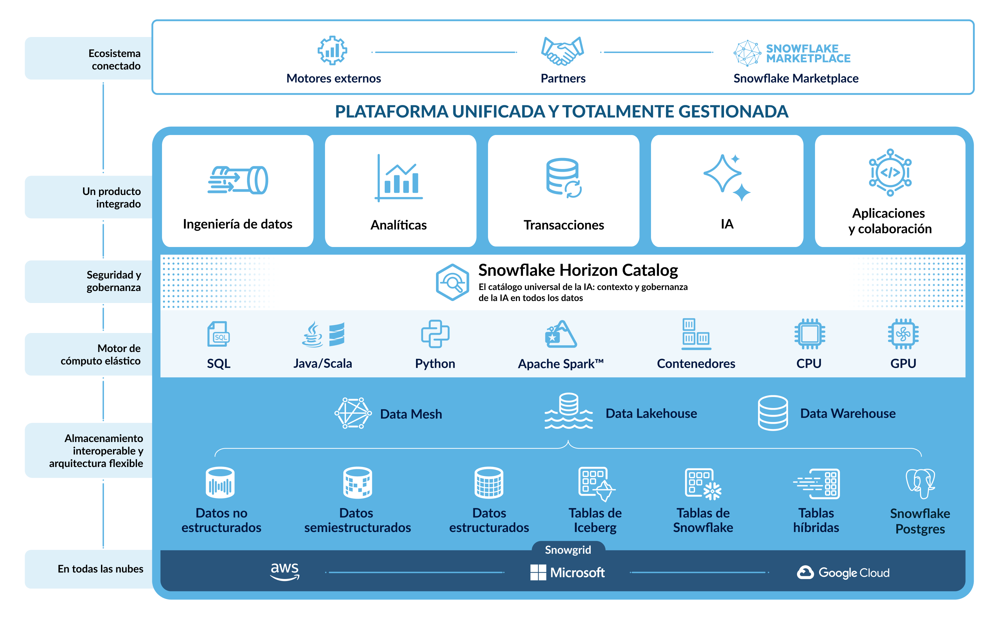
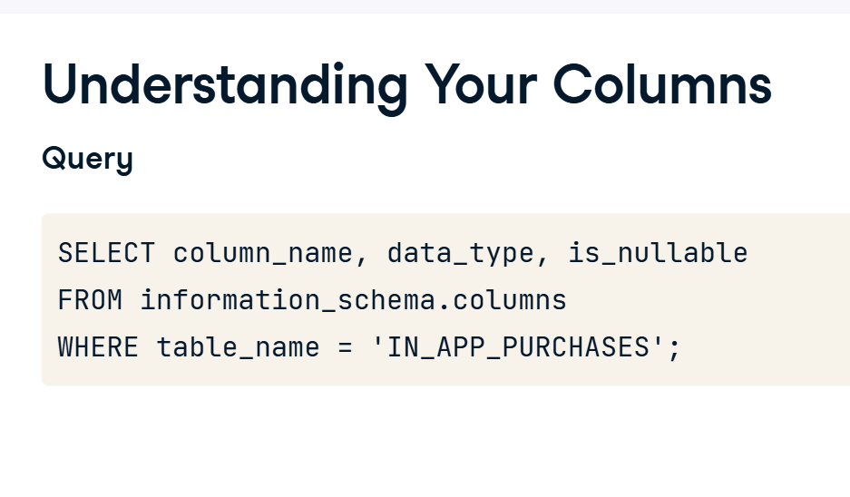
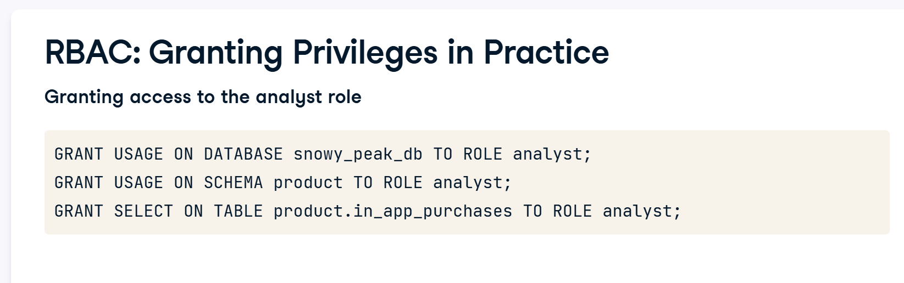

´´´sql
-- 1. Seleccionar el almacén (Warehouse) de cómputo
USE WAREHOUSE DATACAMP_UI_AI_PROD;

-- 2. Seleccionar la base de datos (Database)
-- Asegúrate de que el nombre comience con 'COURSE_'
USE DATABASE COURSE_DB; -- Reemplaza 'DB' con el nombre completo si es diferente

-- 3. Seleccionar el esquema (Schema)
USE SCHEMA RAW;
´´´